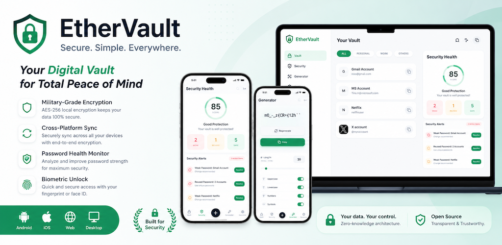

# EtherVault - 로컬 비밀번호 관리 도구

EtherVault는 산업 등급의 보안과 원활한 사용자 경험을 위해 설계된 현대적이고 교차 플랫폼을 지원하는 비밀번호 관리자입니다. 데스크톱 및 모바일 (Android/iOS) 플랫폼을 지원하여 민감한 자격 증명을 안전하게 저장, 관리 및 동기화할 수 있도록 돕습니다.

[English](./README.md) | [中文](./README.zh.md) | [日本語](./README.ja.md) | 한국어



## 📖 프로젝트 개요

EtherVault는 Monorepo 아키텍처를 사용하여 구축되었으며, 핵심 비즈니스 로직을 UI 레이어와 분리하여 다양한 플랫폼에서 높은 코드 재사용성과 일관성을 보장합니다. 강력한 로컬 암호화 (AES-256)를 내장하고 있으며, Google Drive와 같은 주요 클라우드 스토리지 서비스와의 종단간 암호화 동기화를 지원합니다. 또한 생체 인식 잠금 해제, 비밀번호 상태 분석 등 고급 기능을 통합하여 사용자에게 가장 안전한 디지털 금고를 제공하기 위해 헌신하고 있습니다.

## 🚀 주요 기능

### 🔐 핵심 금고
- **자격 증명 관리**: 사용자 이름, 비밀번호, URL 및 메모를 안전하게 저장합니다.
- **효율적인 검색**: 퍼지 검색, 카테고리 필터링 (전체, 개인, 업무, 기타) 및 다차원 태그 관리를 지원합니다.
- **스마트 아이콘**: 웹사이트 아이콘을 자동으로 가져와 표시하여 보다 나은 시각적 경험을 제공합니다.

### 🛡️ 보안 대시보드
- **보안 점수**: 비밀번호 복잡도 알고리즘을 기반으로 금고의 상태를 실시간으로 평가합니다.
- **위험 감지**: 취약하거나 재사용된 비밀번호를 자동으로 스캔하고 최적화 제안을 제공합니다.
- **데이터 시각화**: 직관적인 차트를 통해 비밀번호 보안 분포를 시각화합니다.

### 🎲 비밀번호 생성기
- **높은 엔트로피**: 유추할 수 없는 강력한 비밀번호를 생성합니다.
- **높은 사용자 정의**: 사용자 정의 길이(최대 128자) 및 문자 집합(대문자, 소문자, 숫자, 기호)을 지원합니다.
- **원클릭 복사**: 엔트로피를 자동으로 계산하고 생성 후 원클릭 복사를 허용합니다.

### ⚙️ 설정 및 에코시스템
- **클라우드 동기화**: Google Drive와 같은 클라우드 제공업체와 암호화된 데이터 동기화를 지원하여 기기 간의 일관성을 보장합니다.
- **테마**: 다크 모드, 라이트 모드 및 시스템 기본 설정을 지원합니다.
- **다국어 지원**: 내장된 다국어 지원 (영어/중국어/일본어/한국어).
- **데이터 이동성**: 용이한 데이터 마이그레이션을 위한 표준 CSV/JSON 가져오기 및 내보내기를 지원합니다.
- **보안 보호**: 생체 인식 잠금 해제 (FaceID/TouchID), 자동 잠금 및 로컬 작업 로그 감사를 지원합니다.

## 🛠️ 기술 스택

이 프로젝트는 현대적인 프론트엔드 기술 스택을 기반으로 구축되었습니다:

- **핵심 언어**: [TypeScript](https://www.typescriptlang.org/)
- **UI 프레임워크**: [React 19](https://react.dev/)
- **빌드 도구**: [Vite](https://vitejs.dev/)
- **스타일링**: [Tailwind CSS](https://tailwindcss.com/)
- **크로스 플랫폼 런타임**:
  - **데스크톱**: [Electron](https://www.electronjs.org/)
  - **모바일**: [Capacitor 8](https://capacitorjs.com/)
- **애니메이션**: [Framer Motion](https://www.framer.com/motion/)
- **차트**: [Recharts](https://recharts.org/)
- **상태 관리**: 사용자 정의 Hook 및 Context API
- **패키지 관리**: NPM Workspaces

## 💻 개발 가이드

### 필수 조건
- Node.js (v18 이상 권장)
- NPM

### 1. Google Console 설정 (클라우드 동기화용)
앱을 실행하기 전에 Google Drive 동기화를 활성화하기 위해 Google Cloud Console에서 프로젝트를 설정해야 합니다:

1.  [Google Cloud Console](https://console.cloud.google.com/)에 접속합니다.
2.  새 프로젝트를 생성합니다 (예: `ethervault-dev`).
3.  **API 활성화**:
    *   **APIs & Services > Library**로 이동합니다.
    *   **Google Drive API**를 검색하고 활성화합니다.
4.  **OAuth 동의 화면 구성**:
    *   **APIs & Services > OAuth consent screen**으로 이동합니다.
    *   **External**을 선택합니다.
    *   필수 앱 정보를 입력합니다.
    *   자신의 이메일을 **Test User**로 추가합니다.
5.  **자격 증명 생성 (Web 클라이언트)**:
    *   **APIs & Services > Credentials**로 이동합니다.
    *   **Create Credentials > OAuth Client ID**를 클릭합니다.
    *   승인된 JavaScript 원본 추가: `http://localhost:3000` (필요 시 `http://localhost:5173` 추가).
    *   승인된 리디렉션 URI 추가: `http://localhost:3000` (필요 시 `http://localhost:5173` 추가).
    *   **Client ID**를 복사합니다.
6.  **자격 증명 생성 (iOS 클라이언트)**:
    *   **APIs & Services > Credentials**로 이동합니다.
    *   **Create Credentials > OAuth Client ID**를 클릭합니다.
    *   애플리케이션 유형: **iOS**.
    *   Bundle ID 추가: `com.ethervault.app`.
    *   **Client ID**를 복사합니다.
7.  **환경 변수 구성**:
    *   `packages/app/.env` 파일을 생성합니다 (`.env.example`에서 복사).
    *   자격 증명을 추가합니다:
        ```bash
        # 로컬 개발용
        VITE_GOOGLE_CLIENT_ID=your_client_id_here
        # iOS, Android, 데스크톱의 네이티브 앱용
        VITE_GOOGLE_CLIENT_ID_IOS=your_client_id_here
        ```

### 2. 의존성 설치
프로젝트 루트 디렉토리에서 실행합니다:
```bash
npm install
```

### 3. 개발 환경 시작

**Web 모드 (브라우저):**
```bash
npm run dev
```

**데스크톱 모드 (Electron):**
```bash
npm run dev:desktop
```

**모바일 동기화 (Capacitor):**
```bash
npm run mobile:sync
```

### 4. 빌드 및 패키징

**Web 에셋 빌드:**
```bash
npm run build
```

**데스크톱 앱 빌드:**
```bash
npm run dist:desktop
```

**iOS/Android 빌드:**
```bash
# iOS
npm run build:ios

# Android
npm run build:android
```

### 5. 기타 명령

**프로젝트 정리:**
```bash
npm run clean
```

**타입 검사:**
```bash
npm run type-check
```

## 📄 라이센스

이 프로젝트는 [MIT 라이센스](LICENSE) 하에 라이센스가 부과됩니다. 별도로 명시되지 않는 한 이 프로젝트의 코드를 자유롭게 사용, 수정 및 배포할 수 있습니다.

## 🤝 기여

기여는 언제나 환영합니다! 제안이 있거나 버그를 발견하면 다음 단계를 따라주세요:

1. 리포지토리를 포크합니다.
2. 기능 브랜치를 생성합니다 (`git checkout -b feature/AmazingFeature`).
3. 변경 사항을 커밋합니다 (`git commit -m 'Add some AmazingFeature'`).
4. 브랜치에 푸시합니다 (`git push origin feature/AmazingFeature`).
5. 풀 리퀘스트를 엽니다.

---
**EtherVault** — 로컬에서 안전하게, 전 세계와 동기화.
